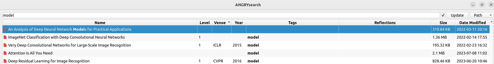

# Paper Manager

<font color = red>There are still numerous bugs in this paper manager. Now, it can work well by following some routines. I will improve the code, provide detailed descriptions and add new functions when I have time.</font>

A paper manager built on [ANGRYsearch](https://github.com/DoTheEvo/ANGRYsearch).

**Motivations:** 

+ *Manage papers efficiently.* I used to categorize papers in different folders and search them by [FSearch](https://github.com/cboxdoerfer/fsearch). However, as the papers increases, I cannot deal with them efficiently, especially for the unfamiliar papers. By the way, there are many popular paper managers in the market, e.g., zotero.
+ *Customize.* Even though I like FSearch, I find that it is written in C. Since my research interests are AI, Python is more user-friendly for me. That is why I choose [ANGRYsearch](https://github.com/DoTheEvo/ANGRYsearch).

## Features

The overview of this paper manager



The columns are name, level, venue, year, tags, reflections, size, and date modified.

+ Level: You can adjust it according to your proficiency level of a paper.
+ Reflections: You can add some reflections of a paper to remind your of the digest of this paper.

## How to use?

The main file is `angrysearch.py`. All the modifications are made on it.

In fact, this paper manager is a file searching software indeed. So some requirements should be satisfied to make it work.

+ Path: We need modify some paths based on our own settings. (Sometimes, the line number may be different, we can search the variable name)

  Line 53: database_dir

  Line 298: root_dirs

  Line 552 (optional): you can modify the column width

+ File name: I rename all the papers with their title (without some characters, e.g., `:`, `_`). I have add some restrictions on the filename of the paper (see the function `check_paper_name()`)

  Line 282:  the function `check_paper_name()`

+ Database (metadata.db): Then new a sqlite3 dabase file in `~/.cache/angrysearch/`.

  ```
  sqlite3 `~/.cache/angrysearch/metadata.db`
  CREATE TABLE metadata (
      name TEXT PRIMARY KEY,
      level TEXT,
      venue TEXT,
      year TEXT,
      tags TEXT,
     	reflections TEXT);
  ```

+ Run the python file with `python angrysearch.py`.

## Modifications on ANGRYsearch

The core functionality is from ANGRYsearch.

The main modifications are:

+ I add one database called metadata.db to save the metadata of the papers in the `~/.cache/angrysearch/` (the same location as `angry_database.db`).

  The structure of table metadata.

  ```
  name, level, venue, year, tags, reflections
  ```

+ The original virtual table turns to

  ```
  directory, path, level, venue, year, tags, reflections, size, date
  ```
  The `directory` is just a bool to show the whether the filename is a folder. In fact, I have removed all the folders, so it is useless in this software.

+ I add one `Qw.QComboBox()` (with Path, Venue and Tags items) for searching by different columns.

## Bugs
+ 2024-01-18: The ``<'' can not be displayed well.

## References

https://www.cnblogs.com/cloudhan/articles/17020139.html

https://github.com/janbodnar/PyQt6-Tutorial-Examples

https://github.com/DoTheEvo/ANGRYsearch

https://github.com/PyQt5/PyQt?tab=readme-ov-file

https://github.com/maicss/PyQt-Chinese-tutorial
